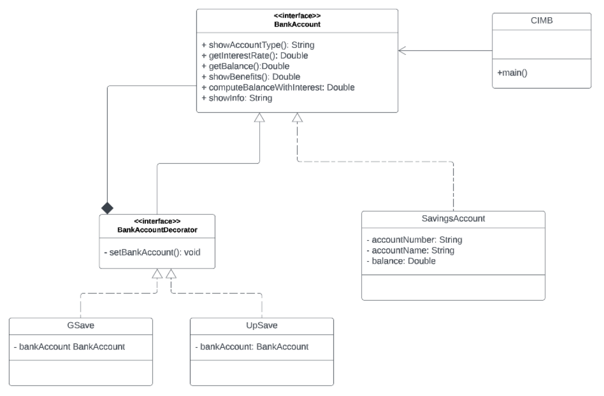
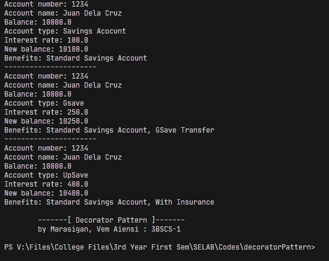

## LAB Assignment 10: Decorator Pattern
Marasigan, Vem Aiensi A.  
3BSCS-1 | CSL311  
## <a href = "https://github.com/VemAiensi/SoftEng1/blob/main/RunCode/HowToRunCodeIntelliJ.md">HowToRun</a>

### Problem Statement

**Decorator Pattern: CIMB**

* CIMB is a digital bank that offers GSave and UpSave savings accounts. As with a typical
Savings Account, it contains accountNumber, accountName, and a balance for that account.

* The typical savings account offers an interest rate of 1%.
The benefits of the typical savings account is the same with the "Standard Savings Account" as
compared to other banks.

* The GSave account offers an interest rate of 2.5%.
Benefits include the "Standard Savings Account" plus access to "GCash transfer".

* The UpSave account offers the highest interest rate of 4.0%.
Benefits include the "Standard Savings Account" plus "with Insurance".

Description of the following methods
1. **showAccountType()** - Either returns "Savings Account", "GSave" or "UpSave"
2. **getInterestRate()** - Either returns 1% for Savings Account; 2.5% for GSave; 4.0%
UpSave
3. **getBalance()** - Returns the balance of the account set.
4. **showBenefits()** - Either returns "Standard Savings Account" for Savings Account;
benefits offered by savings account + "GSave Transfer";
benefits offered by savings account + "With Insurance";
5. **computeBalanceWithInterest()** - returns new balance by computing the balance plus
the interest depending on the interest rate.
6. **showInfo()** - Returns details of account number, account name, and balance.

*BankAcountDecorator must be an interface.*

Develop a decorator pattern approach that will implement the given UML diagram:

### UML Diagram

### Sample Output

